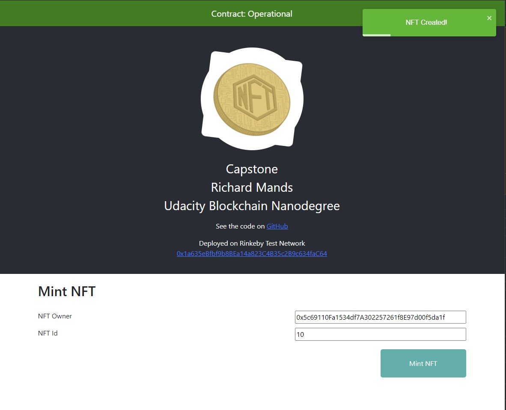

# Real Estate Marketplace Capstone
My Version of Udacity Real Estate Marketplace Capstone project.

This repository contains Smart Contract code in Solidity (using Truffle), tests (also using Truffle), dApp scaffolding (React) and ZoKrates for simulated verification of ownership.

## NFTs on OpenSea
https://testnets.opensea.io/collection/capstone-bnnnpllu2b

## See Contract on Rinkeby
https://rinkeby.etherscan.io/address/0x1a635eBfbf9b8BEa14a823C4B35c2B9c634faC64
## Contract deployment transaction
https://rinkeby.etherscan.io/tx/0x2e1ae78e4b805316288fab2211837c60c7cbf7c34a56372593f1eb83e0509d2c

## App Summary
ERC721 NFTs created after checking proof of ownership via ZoKrates

NFTs available on OpenSea

## Running the app
- Run Ganache CLI or `truffle develop`
- Pull down the code from GitHub

### Contracts
- Run `truffle compile` and `truffle migrate` commands from the root directory

### The Front-End
- `cd react-app`
- `yarn start`

### Run Tests
- Run Ganache CLI or `truffle develop`
- Update `truffle-config.js` with correct host port
- Run `truffle test` from the root directory

## Tests
- Mocha for contract tests
- Errors visible in console logs are confirming failure when account with wrong permissions attempts an action.
- [See Tests Here](https://github.com/richardmands/realEstateMarketplace/tree/master/test)

## Required Libraries
- Truffle v5.3.6
- Solidity v0.8.0
- Web3 v1.3.0
- Node v14
- ZoKrates v0.7.6

- These libraries are required for this project. I used more recent versions than in the course outline as I want my learning to be as current as possible.

## Optional Libraries
- Create React App. Used to provide a great starting point for the UI. UI was created for minting the 10 required NFTs

- Ganache. Used for local development before deploying my contracts to the Rinkeby Test Network. Used with Ganache UI as it provides useful real-time updates on transactions.

# Project Resources

* [Remix - Solidity IDE](https://remix.ethereum.org/)
* [Visual Studio Code](https://code.visualstudio.com/)
* [Truffle Framework](https://truffleframework.com/)
* [Ganache - One Click Blockchain](https://truffleframework.com/ganache)
* [Open Zeppelin ](https://openzeppelin.org/)
* [Interactive zero knowledge 3-colorability demonstration](http://web.mit.edu/~ezyang/Public/graph/svg.html)
* [Docker](https://docs.docker.com/install/)
* [ZoKrates](https://github.com/ZoKrates/ZoKrates)
